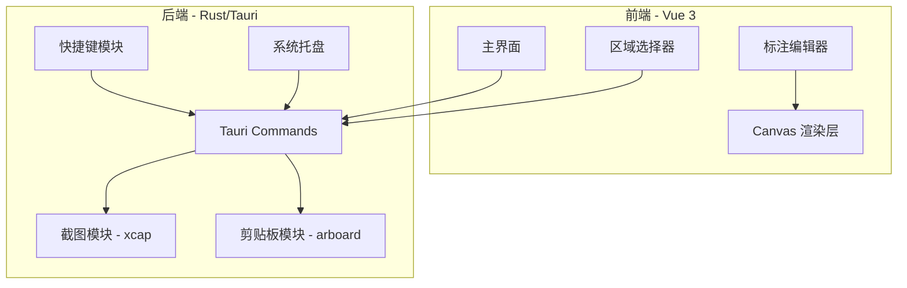
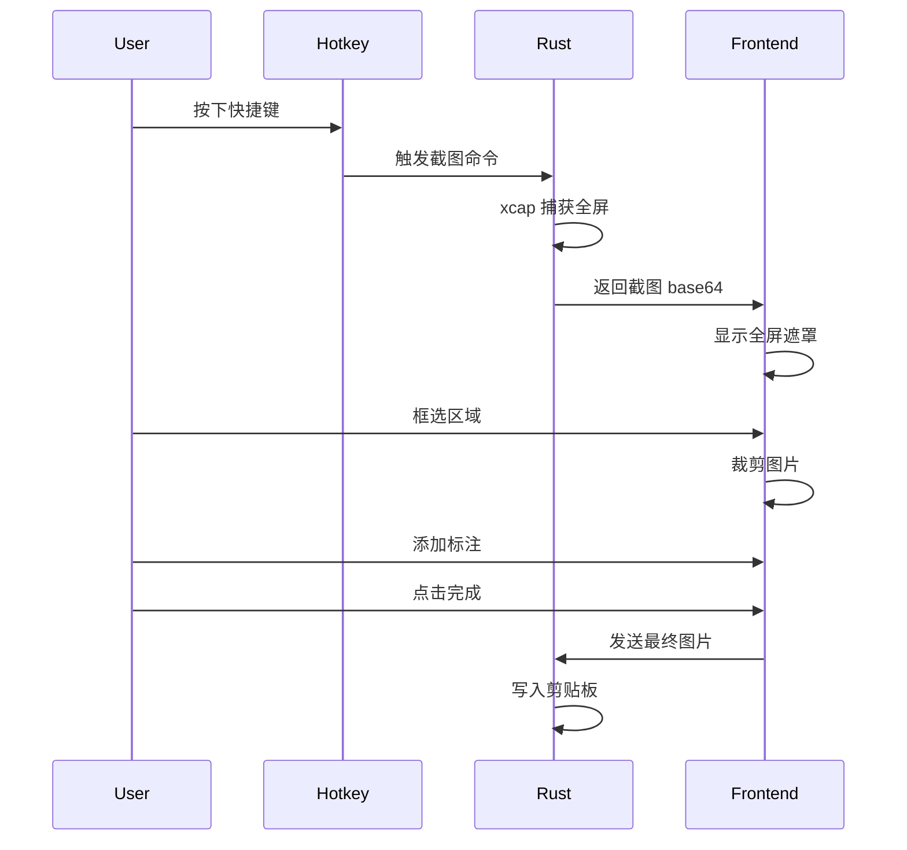

# PrinSp - Linux 截图工具架构设计

## 项目概述

一个类似 PixPin 的 Linux 截图工具，支持区域截图、标注和剪贴板集成。

## 技术栈

- **后端**: Rust + Tauri v2
- **前端**: Vue 3 + TypeScript + Canvas API
- **截图**: xcap (跨平台截图库)
- **剪贴板**: arboard
- **全局快捷键**: tauri-plugin-global-shortcut

## 架构图



## 目录结构

```
prinsp/
├── src-tauri/
│   ├── src/
│   │   ├── main.rs              # 入口
│   │   ├── lib.rs               # 库入口
│   │   ├── commands/
│   │   │   ├── mod.rs
│   │   │   ├── screenshot.rs    # 截图命令
│   │   │   └── clipboard.rs     # 剪贴板命令
│   │   └── utils/
│   │       └── mod.rs
│   ├── Cargo.toml
│   └── tauri.conf.json
├── src/
│   ├── App.vue
│   ├── main.ts
│   ├── components/
│   │   ├── RegionSelector.vue   # 区域选择器
│   │   ├── AnnotationEditor.vue # 标注编辑器
│   │   └── Toolbar.vue          # 工具栏
│   ├── composables/
│   │   ├── useScreenshot.ts     # 截图逻辑
│   │   ├── useAnnotation.ts     # 标注逻辑
│   │   └── useCanvas.ts         # Canvas 操作
│   └── types/
│       └── index.ts
├── package.json
└── vite.config.ts
```

## 核心模块设计

### 1. 截图流程



### 2. Rust 后端 API

```rust
// commands/screenshot.rs
#[tauri::command]
async fn capture_screen() -> Result<String, String> {
    // 使用 xcap 捕获主显示器
    // 返回 base64 编码的 PNG
}

#[tauri::command]
async fn capture_region(x: i32, y: i32, w: u32, h: u32) -> Result<String, String> {
    // 捕获指定区域
}

// commands/clipboard.rs
#[tauri::command]
async fn copy_image_to_clipboard(base64_data: String) -> Result<(), String> {
    // 使用 arboard 写入剪贴板
}
```

### 3. 前端组件

#### RegionSelector - 区域选择器
- 全屏透明窗口覆盖
- 鼠标拖拽选择区域
- 显示选区尺寸
- 支持调整选区大小

#### AnnotationEditor - 标注编辑器
- Canvas 双层结构（底图层 + 标注层）
- 工具：箭头、矩形、文字、马赛克
- 撤销/重做栈
- 颜色/粗细选择

#### Toolbar - 工具栏
- 悬浮在选区下方
- 工具切换按钮
- 完成/取消按钮

### 4. 标注数据结构

```typescript
interface Annotation {
  id: string
  type: 'arrow' | 'rect' | 'text' | 'mosaic'
  points: Point[]
  style: {
    color: string
    lineWidth: number
    fontSize?: number
  }
}

interface EditorState {
  image: ImageData
  annotations: Annotation[]
  currentTool: ToolType
  history: Annotation[][]
  historyIndex: number
}
```

## 关键依赖

### Cargo.toml
```toml
[dependencies]
tauri = { version = "2", features = ["tray-icon"] }
xcap = "0.0.14"
arboard = "3"
base64 = "0.22"
image = "0.25"

[dependencies.tauri-plugin-global-shortcut]
version = "2"
```

### package.json
```json
{
  "dependencies": {
    "vue": "^3.5",
    "@tauri-apps/api": "^2"
  },
  "devDependencies": {
    "@tauri-apps/cli": "^2",
    "vite": "^6",
    "@vitejs/plugin-vue": "^5",
    "typescript": "^5"
  }
}
```

## 窗口配置

```json
// tauri.conf.json
{
  "app": {
    "windows": [
      {
        "label": "main",
        "visible": false,
        "skipTaskbar": true
      },
      {
        "label": "capture",
        "fullscreen": true,
        "transparent": true,
        "decorations": false,
        "alwaysOnTop": true,
        "visible": false
      }
    ],
    "trayIcon": {
      "iconPath": "icons/tray.png",
      "iconAsTemplate": true
    }
  }
}
```

## 快捷键配置

| 快捷键 | 功能 |
|--------|------|
| Ctrl+Shift+A | 区域截图 |
| Ctrl+Shift+S | 全屏截图 |
| Escape | 取消截图 |
| Enter | 确认截图 |
| Ctrl+Z | 撤销标注 |
| Ctrl+Y | 重做标注 |

## 实现优先级

1. **P0 - 核心功能**
   - 全屏截图捕获
   - 区域选择器
   - 复制到剪贴板

2. **P1 - 标注功能**
   - 箭头工具
   - 矩形工具
   - 文字工具
   - 马赛克工具

3. **P2 - 体验优化**
   - 全局快捷键
   - 系统托盘
   - 撤销/重做

4. **P3 - 扩展功能**
   - 保存到文件
   - 窗口截图
   - 钉图功能